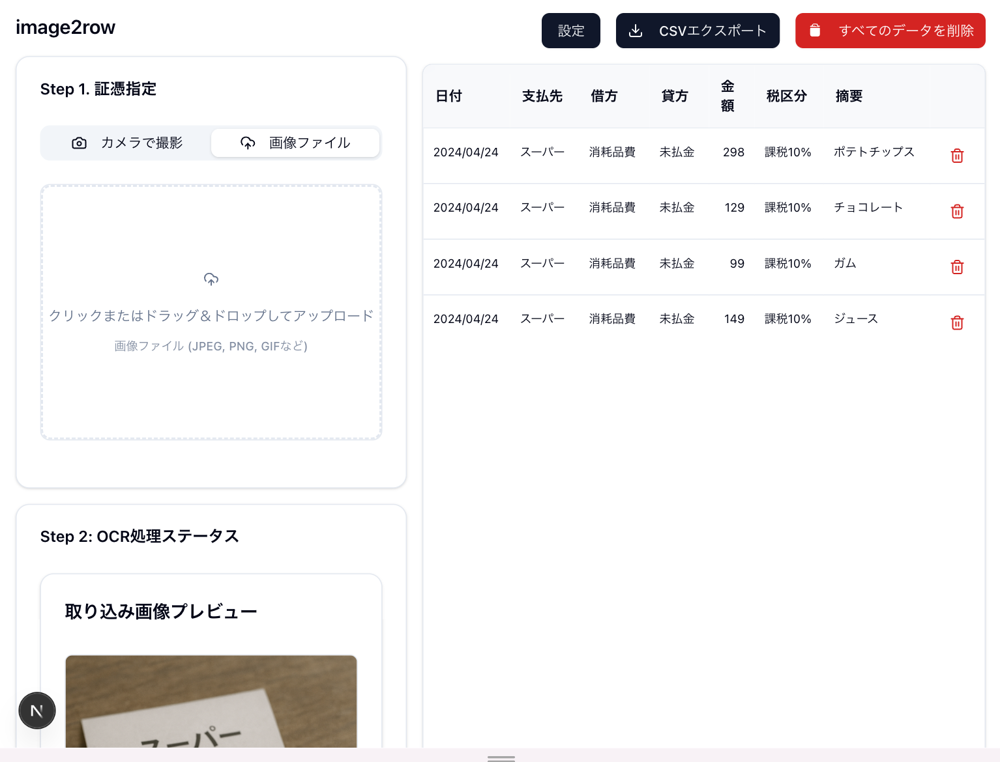

# image2row

ウェブカメラでレシートを撮影すると、AI-OCR(Gemini)で情報を抽出して表形式に変換します。
作成したテーブルはマネーフォワードクラウド会計で仕訳帳インポートに使用可能なCSV形式にエクスポートできます。



## 実行方法

```bash
# GEMINI_API_KEY を設定
cp env.example .env.local
vim .env.local

# 依存パッケージのインストール
npm install

# 開発サーバーの起動
npm run dev
```
